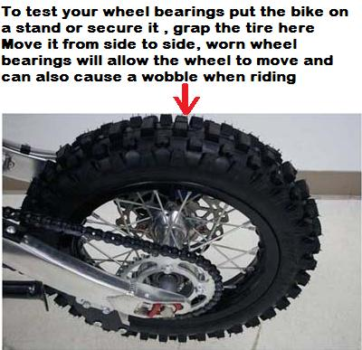

---
tags:
- specs
- wheels
---

# Inspecting Wheel Bearings

To test your wheel bearings put the bike a a stand or secure it , grap the tire here Move it from side to side, worn wheel bearings will allow the wheel to move and can also cause a wobble when riding.

