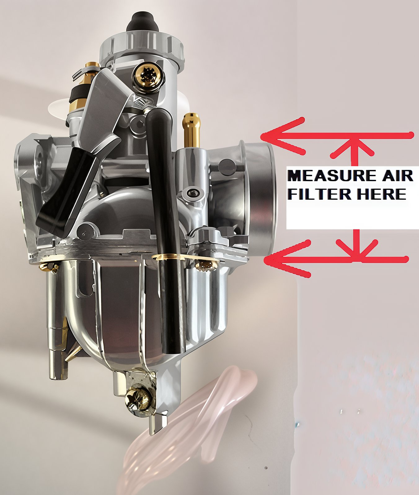

---
tags:
- specs
- carb
---

# Measuring for an Air Filter

To determine the size, measure the outer diameter (OD) of the filter end of the carburetor. Illustrated here is a typical Pit bike 22mm Mikuni carburetor. The OD of the filter end measures 1.5 inches or 38mm.

