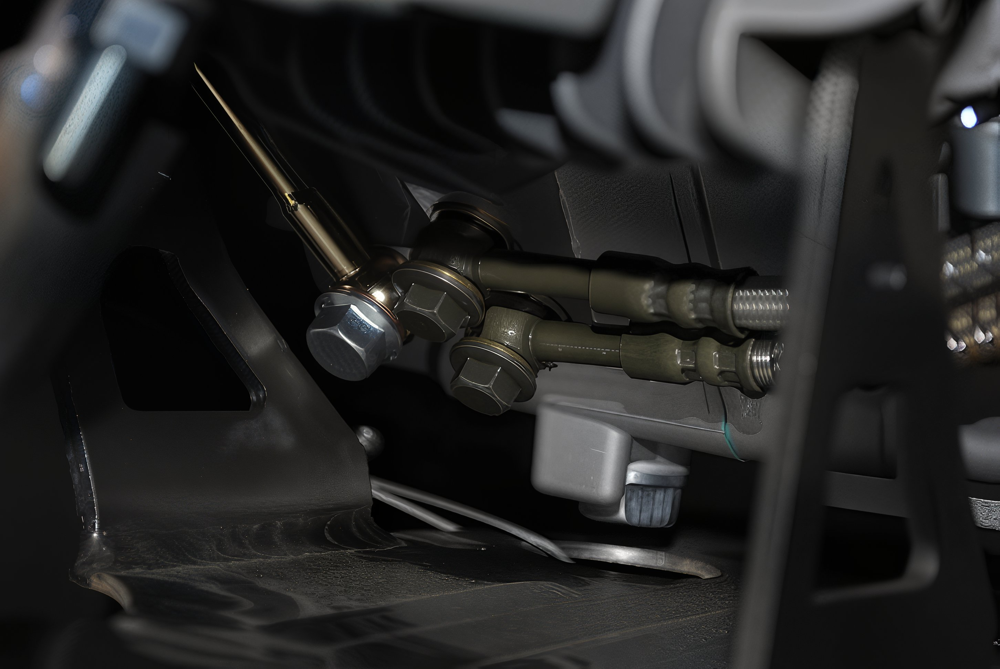
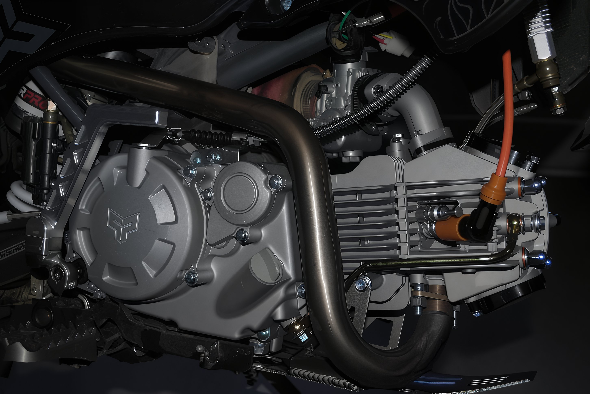

---
tags:
- engine
- oil
---

# Oil Cooler Connections

For pit bike engines equipped with bottom oil cooler connections, it is imperative to either install an oil cooler or connect the two oil cooler ports with a jumper. Failure to adhere to this requirement will result in engine damage.

Please refer to the following images for guidance on connecting the oil cooler:

  
  
  

