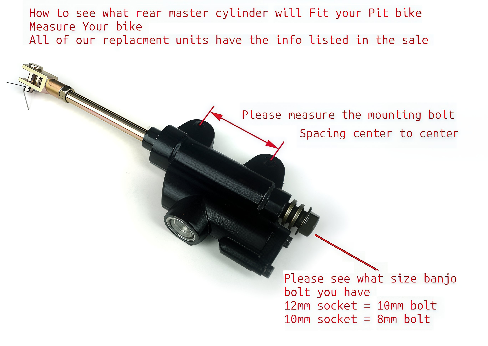

---
tags:
- brakes
- specs
---

# Rear Brake Master Cylinder

How to see what rear master cylinder will Fit your Pit bike. Measure Your bike. Please measure the mounting bolt spacing center to center.

Please see what size banjo bolt you have 12mm socket = 10mm bolt 10mm socket = 8mm bolt.

