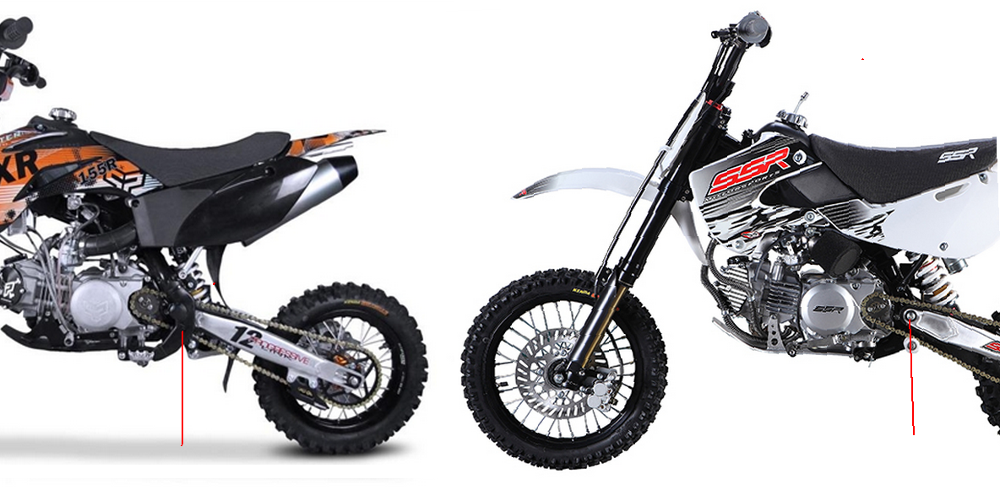

---
tags:
- frame
- specs
---

# Swing-Arm Pivot Systems

## LXR and CRF50-style Frames

These frames are designed to support the swing-arm pivot at the center as well as on both sides.

In contrast to the majority of other Pit bikes, such as the CRF50, XR50, KLX110, and Minis, which only provide support for the swing-arm at the center.

