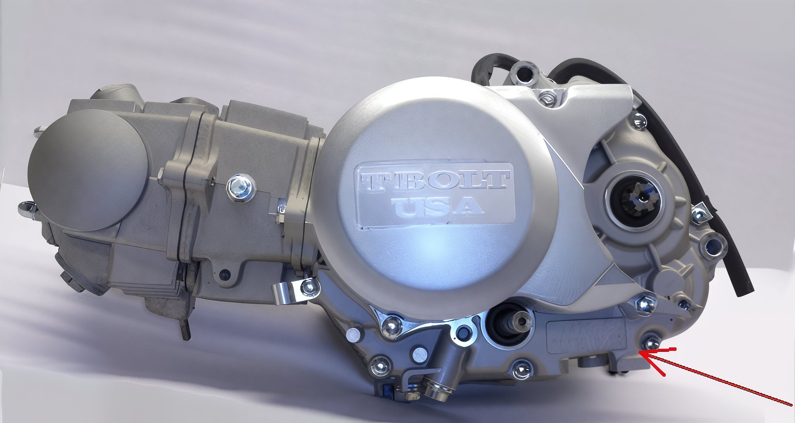

---
tags:
- frame
---

# VIN Location

The Vehicle Identification Number (VIN) is situated on the motorcycle's frame, adjacent to the steering head. Kindly provide this information through text and accompanying image.

## Engine Number

