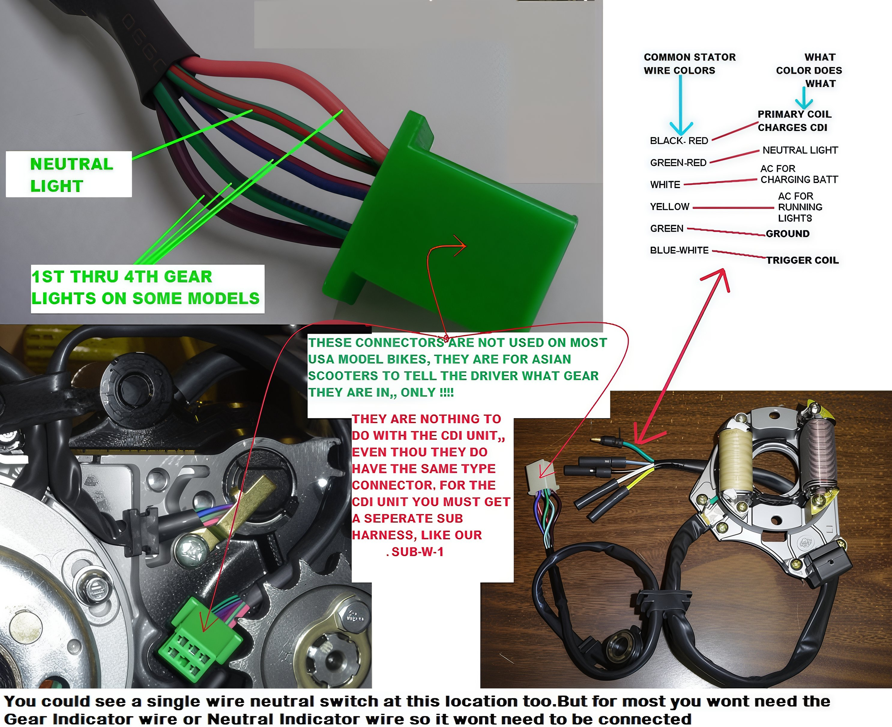

# Wires You Likely Won't Need

For dirt bikes, it is probable that only three wires emanating from your engine will be necessary. The remaining wires are intended for accessories and will not be required. The white and yellow wires, or two yellow wires, are superfluous for dirt bikes.

The neutral indicator wire is also unnecessary for dirt bikes.

Additionally, the neutral and gear switch wires will not be needed, as illustrated.

