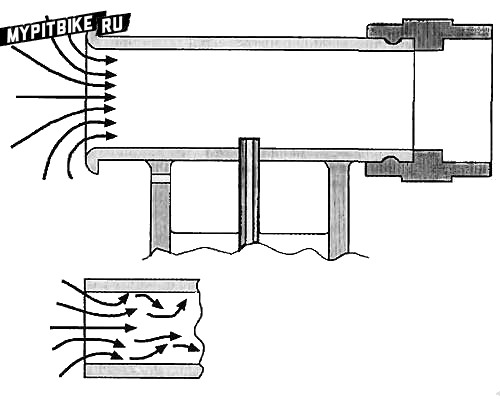
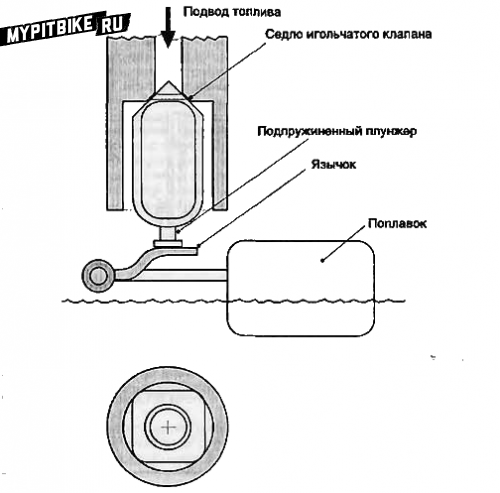
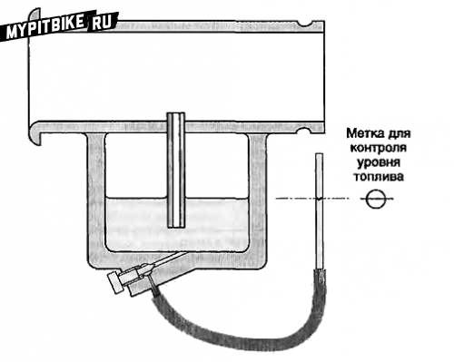
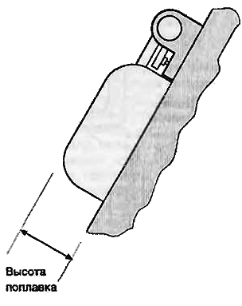
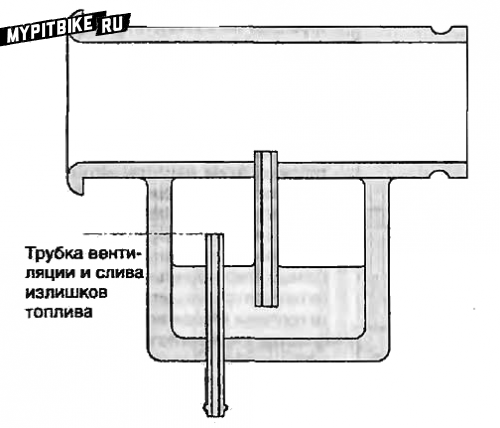
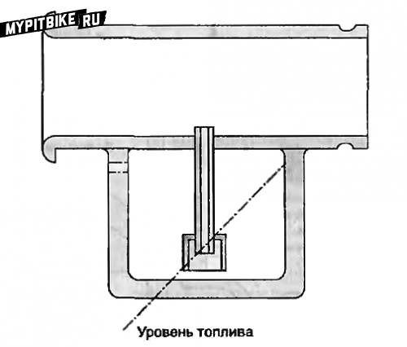
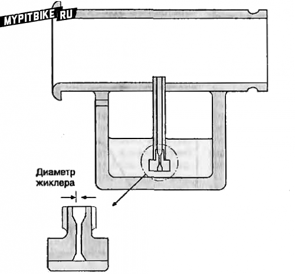
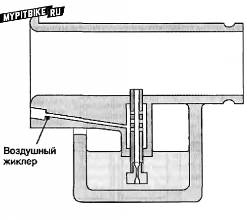

# Carburetor mechanism (part 1)

**A Moment of Classic Insight**  
Excerpt from "Motorcycle Fuel Systems" by Robinson, focusing on the anatomy of a carburetor. The following elaborate text will deepen your understanding of carburetor design and function, providing valuable insight for troubleshooting fuel delivery issues. Due to its length, the post will be divided into several parts.

## Introduction

The operation of a carburetor is based on the chemical and physical properties of gases, as discussed in the preceding chapters. To appreciate the carburetor's design, let's delve into constructing a simple yet functional carburetor, focusing on the flow of a jet within a tube. The cross-sectional area of the carburetor's air channel must be sufficiently large to supply air at maximum engine power, yet small enough to speed up airflow and create adequate vacuum between the float chamber and the fuel nozzle. The pressure above the fuel nozzle relies on air velocity, hence older carburetor designs incorporated a narrowing around the nozzle to augment local airspeed. This narrowing is known as a diffuser or Venturi tube, named after Italian physicist Giovanni Battista Venturi (1746-1822). This constriction restricts airflow and thus isn't used in performance-oriented motorcycle carburetors, though the term persists to denote this carburetor section.

> Fig. 1. An elementary carburetor – a fuel reservoir connects with a diffuser. The rounded "bell" prevents turbulence and helps enhance the carburetor's flow capacity. A rubber support wards off vibration and heat from affecting the diffuser.

Our basic carburetor consists solely of a diffuser and a fuel supply tube (Fig. 1). We could augment it with a few enhancements. Airflow experimentation indicates that an air duct becomes more efficient if its end curves at 180 degrees. The duct must be as straight and smooth as possible, devoid of obstacles, pockets, or sharp bends, which could instigate air turbulence. The carburetor's second end attaches to the engine on a resilient mount, ideally without projections, shielding the carburetor from engine-induced heat and vibration. Increased gas temperature lowers density, meaning the same volume contains less mass (fewer molecules); hence, fewer fuel molecules will burn. Vibration poses the same issues as in other mechanisms, potentially causing fuel foaming and compromised valve efficiency. The shut-off valve is the next enhancement, maintaining a definite fuel level.

## Fuel Supply

Fuel is supplied from the tank via a pump or gravity, passing through a valve comprised of a conical needle (Fig. 2). A float in the fuel tank sustains the needle; as tanks fill with fuel, the float rises, and the needle seals the valve, shutting off fuel flow. Usually, the needle features a spring-loaded plunger pressing against the float's tongue, mitigating vibration impacts and ensuring a precise fuel level. Such valves are susceptible to debris blocking proper closure. Therefore, a fuel filter is typically installed before the valve. The valve can be adjusted in two ways. First, the float height determines fuel level in the tank, adjustable by bending the tongue resting against the needle.

> Fig. 2. Needle valve. As fuel level rises to a certain point, the float presses the needle to the seat, halting fuel supply.

The float height can be gauged both by the fuel's level in the chamber and the float's height when the valve completely closes. Any carburetor manual will guide you on measuring float height. If controlling fuel levels in the float chamber is necessary, connect the chamber with a transparent tube and insert a shut-off valve (Fig. 3).

> Fig. 3. Fuel level sensor. The float chamber connects by a hose to a clear tube through which fuel level is visible. The fuel level is gauged against a point on the carburetor body (typically near the float chamber gasket).

Align the transparent tube parallel to the float chamber and open the valve. The fuel level in the tube equates to that in the float chamber. Marking the tube allows easy fuel level monitoring. Typically, the fuel level in the chamber is measured from a specific reference point (usually the chamber gasket). A manual pump may restore the desired fuel level if present. For fuel level adjustment, removing the carburetor from the motorcycle, the float chamber’s lid, and turning it upside-down is required. Adjustment is achieved by altering the float height relative to the gasket surface, with the float pressing the needle valve against the seat (Fig. 4).

> Fig. 4 Adjusting fuel level within a carburetor. It usually involves measuring the float's distance from the carburetor gasket. The float should contact the needle valve, but without compressing the valve's spring. Angling the carburetor body, as illustrated, may be necessary.

A T-shaped or square-section tool is commonly used for fuel level checking and adjustment. Another adjustment involves altering the needle valve and seat dimensions, affecting valve sealing. Since float force is constant, valve pressure on the seat depends on seat diameter and valve area. A smaller diameter implies greater pressure. This pressure must surpass pressure in the fuel line, determined by tank height and pressure created by the pump and regulator. As fuel line pressure increases, reducing valve diameter prevents fuel overflow. As fuel enters the float chamber, air must escape. Venting is combined with a drain tube for excess fuel drainage in flooding (Fig. 5). Overflowing fuel is a critical issue; liquid fuel accumulates atop the piston, leading to potential piston ring and rod damage when starting.

> Fig. 5. Float chamber ventilation and overflow tube. Air pressure in the float chamber should remain constant. Early carburetor models simply connected the chamber to the atmosphere, with a shared vent and overflow tube. Overflow allowed fuel drainage, preventing liquid fuel entry into the engine. In later models, float chamber pressure equals that in the air chamber.

Motorcycles using air chambers for increased power maintain equal pressure in the float chamber. Venting leads into the air chamber and cannot drain overflow, necessitating a shut-off valve post-engine cutoff. In our carburetor, the float chamber rests directly below the fuel nozzle, like in modern motorcycle carburetors, although previously, the chamber lay side-by-side or disconnected and linked via tubing. An independently mounted float chamber occasionally simplifies setup and facilitates fueling several carburetors simultaneously. Additionally, lowering/raising the chamber adjusts fuel levels, albeit imprecisely. A float chamber's drawback lies in fuel movement: braking pushes it forward, acceleration shifts it aft. Side-mounted chambers don't experience much side force when turning without a sidecar, as bikes lean into turns, keeping fuel level stable. Ironically, separate float chambers coincided with the popularity of sidecar motorcycles. These designs swayed fuel away from and towards the carburetor with left/right turns, respectively. Compensators, supplementary chambers opposite the carburetor, emerged for sidecar bikes. Modern integration sees the float chamber unified with the carburetor, with the fuel nozzle centrally positioned, minimizing level shifts. Nonetheless, level fluctuations remain problematic. Designers counter this via baffles or sleeves over the fuel nozzle (Fig. 6). The simplicity of our theoretical model precludes further float chamber detail exploration.

> Fig. 6. Fuel nozzle baffle. Occasionally fitted over fuel nozzles to stabilize fueling during sharp accelerations and decelerations in motorcycles and sidecar-equipped vehicles experiencing similar effects during turns.

## Fuel Jets

We have a smooth diffuser, a fuel spray nozzle, and a constant fuel supply. The diffuser dimensions must match the engine's requirements, ensuring optimal mixture composition. Thus, the fuel supply tube should support the required fuel flow and atomization. A calibrated throttle called a jet is screwed into the fuel supply tube to achieve this. This setup affords complete control over fuel consumption and is named the main jet (Fig. 7).

> Fig. 7. Main jet. Typically constructed as a mini-diffuser for smooth fuel flow across varying pressure conditions. Jets are marked by their smallest aperture or rated performance at a specific pressure. They appear in differing constructions and materials (usually plastic or brass). Identical construction by different manufacturers doesn't guarantee equal performance; moreover, jet 140 exceeds 135 under identical production, despite the above disparities.

Air speed in a carburetor depends on engine revs and diffuser diameter. Air pressure shifts proportionally with the square of airspeed. If a jet's diameter exceeds the minimally specified threshold for fluid flow (see note 1), the force uplifting fuel rises proportionately with the square of engine speed. Thus, doubling engine speed doubles airspeed (ignoring head loss). Consequently, air pressure drops fourfold, excessively increasing fuel intake. The greater the airspeed variation, the higher the fuel demand discrepancy. A jet maintaining proper mixture at low revs excessively enriches it as revs rise. Conversely, a mix optimized for high-speed running arms under-recovery at lower revs. Variance in fuel delivery at maximum and minimum engine speeds is termed the fuel gradient. Motorcycle carburetors surmount this with air jets, or air correctors, blending air within the fuel delivery tube. Air consumption is regulated by jet diameter, correlating with airspeed squared in the diffuser. This enables proper mixtures beyond singular points. As engine speed smoothly changes, this ensures continuous mixture accuracy.

> Fig. 8. Air jet. A narrow airway that can receive a brass jet. Used for blending air with fuel in the emulsion tube, where holes are drilled.

The effect of air jets grows with engine speed rise. Fitting a fuel jet yielding optimal low-speed mixtures, complementing it with a widening air jet, achieves proper high-speed mixtures. This process may repeat until uniform mixture quality persists across the RPM spectrum. Air jet incorporation resolves multiple issues, offering diverse fuel-air mix strategies. Adjusting air provision height, well size, and hole dimensions in the fuel jet (or emulsion tube) allows mixture fine-tuning. Air-fuel interference generates foam that aids mixing with main airflow, enhancing complete combustion and carburetor sensitivity. Foamed fuel resists back draining to the float chamber better than liquid, enabling rapid engine load variation response. Lastly, an emulsion tube's well, near the diffuser, promotes fast engines’ acceleration reaction. Despite mixture control earnestness, these emulsion tube advantages bear academic interest without a throttle. Our model remains perpetually open, incapable of air consumption or engine load adjustments.

> ### Airspeed, Carburetor Size, and Characteristics

If a cylinder displaces 250 cm³, then during intake, an equivalent air quantum ideally crosses the carburetor within 180 degrees of crankshaft rotation. Knowing maximum engine speed (e.g., 12,000 RPM or 200 RPS), a single revolution lasts 1/200 seconds, with half (180°) taking 1/400 or 0.0025 seconds. Therefore, airflow equals 250/0.0025 or 100,000 cm³/sec. This flow assumes an average value (since intake air speeds from zero to peak and decelerates), providing engine process insight. Calculating airspeed requires flow rate knowledge and carburetor's cross-sectional area. Large engines typically see 38 mm diffuser carburetors, yielding an area: π(38)²/4 = 1134.11 mm² or 11.34 cm². Envision an air column of such a cross-section and height equaling 100,000 cm³. It would measure 100,000/11.34 = 8818.3 cm, or 88.183 m, while at 12,000 RPM, mean airspeed is 88.2 m/s (or 318 km/h). According to Bernoulli’s equation (Chapter 3), with air density at 1.225 kg/m³ and uncompressed flow, a 4.76 kPa pressure drop emerges at the fuel spray point. Assuming 3000 RPM as minimum, recalculated airspeed drops to 22.05 m/s and pressure drop to 0.298 kPa. These values present averaged carburetor speed and pressure. The pressure falloff is slight, especially at low crank RPMs and full throttle opening. Considering fuel density at 0.7 g/cm³, a fuel column height of 43.2 mm arises under 3000 RPM engine conditions. Provided the fuel nozzle height doesn't breach this, the carburetor operates effectively. These reflections demonstrate each carburetor's need for proper pressure range comprehension, alongside airflow considerations.

---

Note 1: Liquid flow within pipes varies, producing a "velocity gradient." Liquid motion slows near surfaces, gaining freedom further away until achieving "unbounded" motion speed. This primarily results from liquid viscosity (shear resistance). Under fluid flow within jets, the boundary layer grows comparable to jet diameter. Acceleration causes layer growth until boundaries encompass the flow cross-section. At this juncture, flow acceleration requires pressure increase until maximum flow rate is achieved.