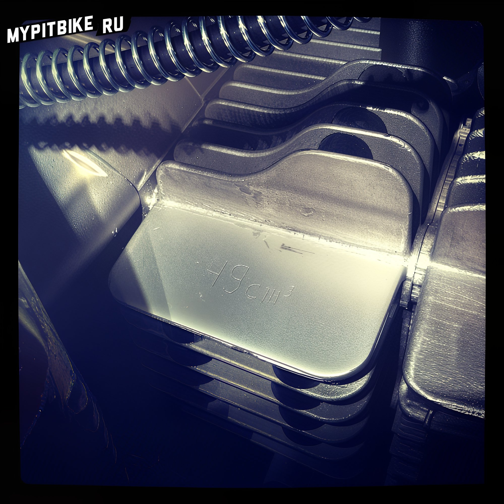

# Do you need a license for a pit bike?

**"Can you ride a pit bike in the city?"** is a fairly common question from those looking to switch, for example, from a scooter to a pit bike as a first motorcycle with a manual transmission, or those wanting to have fun in the city but are concerned about vehicle confiscation and issues with the police. 

#### Let's take a closer look at this question.

Let's start with the fact that everything depends on the engine's displacement. As we know, **if the engine capacity does not exceed 49cc and the designed speed does not exceed 50 km/h, a driver's license is not required to operate such a vehicle (at least for now)**. Pit bikes with a 50cc engine are available, typically the smallest models. Most of them have an automatic clutch, and the seating is designed more for children and teenagers, so they are of little value for our purposes. All "adult" pit bikes are equipped with engines ranging in displacement from **110 to 160 cc** (there are tuning kits increasing displacement up to 200 cc). Here begins the most interesting part: by law, to operate such a machine on public roads, two things are needed:

1. The driver must have an A-category license
2. The vehicle must be registered

While the first point usually does not pose a problem, the second one frequently does. To register a vehicle, at the very least you need a Certificate of Title from the manufacturer, **which is NOT provided with any pit bike**. At most, you need lighting and road tires. Thus, even if a conscientious owner wishes to legalize their vehicle for use on public roads, it won't be possible. Since when purchasing a pit bike, you only receive a bill of sale stating in black and white that the **equipment is not meant for public roads**, the pit bike becomes a piece of sports equipment. To prove ownership, it is sufficient to have a paid invoice (receipt) and a bill of sale. Moreover, many engine manufacturers intentionally mark the engine's displacement by stamping it on the cylinder's cooling fin. What would happen if you ended up in the city with these documents and the "mark" on the engine and were caught by law enforcement? I can't say for sure, but I wouldn't recommend doing so. There are two opposing opinions on the legality of riding **sports equipment on public roads (in the city) without a license**, with quotes and excerpts from traffic rules and codes, which I'll present below.

##### 1. Riding a pit bike in the city can result in impoundment and a 2,500-ruble fine.

> "Motor Vehicle" - a vehicle, other than a moped, powered by an engine. The term also applies to all tractors and self-propelled machinery. 2.1. A driver of a motor vehicle must: 2.1.1. Have and, upon request from law enforcement, present for verification: - a driver's license for the appropriate category of vehicle, or in case of confiscation in the prescribed manner, a temporary permit; - registration documents and a state technical inspection coupon for the vehicle, and if a trailer is available, also for the trailer; - a document confirming the right of ownership, use, or disposal of the vehicle, and if a trailer is attached, also for the trailer, when operating the vehicle without the owner; - in designated cases, a waybill, a license card, and documents for the transported goods, and if transporting oversized, heavy, and hazardous goods, documents stipulated by the rules for transporting these goods; - a mandatory civil liability insurance policy for vehicle owners, when such an obligation is established by federal law. Administrative Offences Code Article 12.7. Operation of a vehicle by a driver without the right to operate a vehicle 1. Operating a vehicle by a driver without the right to operate a vehicle (except for training driving) - shall entail an administrative fine of two thousand five hundred rubles. 2. Operating a vehicle without state registration plates, or driving a vehicle without state registration plates mounted on designated places, or driving a vehicle with state registration plates equipped with materials hindering or obstructing their identification, shall entail an administrative fine of five thousand rubles or deprivation of the right to operate vehicles for a period of one to three months.

In this case, if an officer manages to prove on the spot that you are not operating a moped and do not have an A-category license, **the driver is fined 2,500 rubles, with the possible detention of the vehicle (impoundment).** This situation should be avoided by any means necessary because if your motorcycle is taken from you, you will likely **not be able to retrieve it**, as it does not have a title and proving ownership will be practically impossible! The main point in the dialogue with the traffic officer is that the **pit bike is a 50cc moped**. Proven on the spot, all will be well! I've never encountered cubic capacity measuring devices on the spot.

##### 2. To categorize a pit bike as a vehicle, it must pass a state commission with a title issuance

> Motor vehicle — a motor-driven vehicle designed for transporting goods, passengers, or equipment installed on it. Freight motor vehicles, depending on the body design and other structural features, are divided into: general-purpose vehicles - cars, trailers, and semi-trailers with a non-tipping body, sometimes equipped with hoops and a tarp. They are used for transporting various types of goods; specialized vehicles - cars, trailers, and semi-trailers with various body types designed for transporting certain types of goods (such as dump trucks, tankers, cars with special platforms, etc.); special vehicles - mobile shops, cars with compressor units, truck cranes, street-cleaning vehicles.

In short, a "vehicle" is a device designed for transporting people, goods, or equipment on roads. In summary, **not all means of transportation are considered vehicles**. To become one, it must undergo certification and receive a decision from a state commission that it is safe and meets the necessary standards. Based on this procedure, a Certificate of Title is issued, which determines whether this cart with an engine is a vehicle or not. Otherwise, the definition of a vehicle would include everything: bicycles, rollerblades, skateboards, etc. Upon stopping, a traffic officer does not ultimately know if it is a vehicle or not (and will claim you are driving a motorcycle), but if you have a document certifying the absence of a title, and therefore it is not a vehicle, then penalties apply as for a pedestrian or **moped or bicycle rider**.

> Article 12.29 Part 2 Violation of traffic rules by persons operating a moped, bicycle, horse-drawn vehicle, or other individual participating directly in road traffic (except for individuals mentioned in Part 1 of this article and drivers of motor vehicles) - warning or a fine of 200 rubles. Article 12.29 Part 3 Violation of traffic rules by the persons mentioned in Part 2 of this article, committed while intoxicated - a fine from 300 to 500 rubles.

**In conclusion.** Either you proceed according to the following plan and convincingly demonstrate on site that **you are operating a moped**, or, if you have a full-sized dirt bike, register the motorcycle with a motorcycle federation and obtain a **sports equipment certificate**. However, in the latter case, you should not be on the road. However, as practice shows, there are tricks: ride off the road along the shoulder; dismount and turn off the motorcycle when approaching traffic officers; claim lack of funding for young athletes and absence of a van for transporting the motorcycle to the track.

#### So what do we do?

There is a way out of any situation. **I myself have been riding a pit bike in the city for two seasons now.** During all this time, I've been stopped only once, in a column of bikers heading from a bike festival site into the city. The purpose of the stop was document check and sobriety assessment. Everything was fine, and I went on my way. Now let's get to the most interesting part - what was written in the documents and the secret to peacefully traveling through the city on a pit bike without a license.

1. Immediately after purchasing the pit bike – find where the **engine displacement** is marked. Typically, it's on one of the cylinder's cooling fins.  If the numbers are raised, it will be easier; if engraved, a bit more challenging. Take a rotary tool with a sanding attachment and carefully grind the displacement down to flush with the fin, making it smooth and completely obliterate any indication of prior markings. After smoothing the text, check the texture of the fin; if it's rough, but the sanded area is too smooth, this may raise suspicion. Take coarser sandpaper and achieve a uniform texture by sanding the entire fin. If the cylinder is painted, for instance in black, purchase a can of cheap black heat-resistant paint and touch up the area to match the desired texture by sprinkling a pinch of sand over the wet paint. To ride freely, do not cut corners and underestimate the officers. Do the job neatly, and proving your point, in case of conflict, will be easier. For the especially paranoid, you could also remove the engine markings above the VIN number on the crankcase, but this is not necessary.
2. Try to find someone who can sell you a service book from any Chinese moped with **unfilled fields** on the last page, but includes a payment receipt and the seller's stamp. Two years ago, such a booklet cost about 350 rubles. If not possible, take a [**sample sales contract**](http://mypitbike.ru/downloads/DKP.docx), invite a friend and draw up a contract stating that your friend sold you a scooter (moped) for, let's say, 30 thousand rubles from three years ago. Fill it out honestly, using the sample:

   - ID № VIN – dash
   - Make, model – **moped** or scooter or motor scooter
   - Year of manufacture – current year minus 2-3 years
   - Engine № - **4-stroke 49cc** №\[engine-number-on-crankcase]
   - Body № - dash
   - Chassis (frame) № - frame number found on the triple tree
   - Vehicle Passport – dash
   - Issue Date – dash
   - Color – main plastic color
   - Value – assess the machine reasonably, staying within Chinese moped prices

   Best filled out with a pen over the printed template. After both parties sign, the document should ideally be notarized, but I didn't bother. Make a photocopy of the document or keep the original, place it in a plastic file, and **always carry it with you** along with your ID.
3. Ensure you have a helmet and riding gear; first for your safety, second to reduce reasons for being stopped by police.
4. Make your pit bike resemble a street-legal vehicle. Purchase road tires. Attach bicycle lights to the handlebars and place a tail light under the rear allowing them to be permanently on. If the generator has light coils, install a full street fighter headlight setup.
5. Obey traffic rules, stick to the right side of the road, and keep a meter distance from the sidewalk. Remember you are a road user just like everyone else. **Don't drive drunk, don't cross double solid lines, don't run red lights, don't ignore signs.** When spotting police, avoid showing off your pit bike skills, slow down, shift up aggressively, and travel no faster or noisier than an average Chinese moped to avoid unwarranted attention from officers.
6. Carrying at least 500 rubles in your wallet might be handy for any emergency situations.

The most crucial thing is to fully believe that this is another Chinese wonder, equipped with a clone engine from the legendary Honda Cub or Honda Monkey with a displacement of no more than **49cc.** Why I consider riding a pit bike in the city without a license, while following the above rules, not dangerous to property or personal welfare:

1. No one will suspect that a small pit bike is equipped with a higher displacement engine. There are full-size motorcycles, scooterettes, and mopeds with the same 49cc engine and manual transmission that don't require a license.
2. The Honda Monkey engine is **virtually indistinguishable in displacement between 50 – 150cc.**

#### In case you are stopped by the patrol.

Don't be rude or disrespectful. It’s best not to turn off the engine. Show your documents, and if there are doubts about the engine size, convincingly talk about this marvel of Chinese engineering with an engine whose design age is older than you by half your life. If asked where to buy one – say a friend ordered it, and you don't know where to find more. When asked about the missing lights? – say they were stolen in the parking lot, and you haven't had the chance to install new ones yet. Why does it sound like a 450cc? – blame the Chinese craftsmanship, with a straight-through exhaust and an empty muffler, you're suffering too. If your persuasions aren’t working and things aren’t going your way, remember you're on a vehicle **without state plates, without a license on public roads**. As sports equipment isn't a vehicle, and the shoulder isn’t exactly a public road either. You need to eliminate the cause of detention – **turn off the engine, dismount the bike, push it onto the sidewalk, and walk it home by hand.** Finally, a vehicle can be towed to an impound lot, but not sports equipment, which includes: tennis rackets, bicycles, chess, boxing gloves, and **dirt bikes**.

#### UPDATE 1

In any sale contract, exchange act, and all other appendices to the sale contract, it is **IMPORTANT** to indicate the item purchased as a **Moped** or **Scooter** and not a **motorcycle**! Otherwise, less knowledgeable DPS officers will start emphasizing the absence of an **A-category license** required for operating a motorcycle, disregarding that motorcycles with a 49cc engine exist, legally not requiring a license.  Example of simulating the "correct" displacement